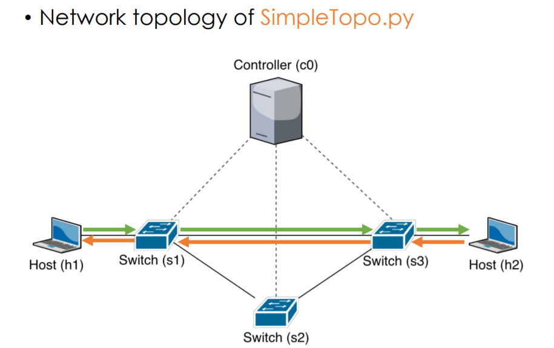

# Route Configuration

This repository is a lab for NCTU course "Introduction to Computer Networks 2018".

---
## Abstract

In this lab, we are going to write a Python program with Ryu SDN framework to build a simple software-defined network and compare the different between two forwarding rules.

---
## Objectives

1. Learn how to build a simple software-defined networking with Ryu SDN framework
2. Learn how to add forwarding rule into each OpenFlow switch

---
## Execution
> create network topology accroding to ./src/topo/topo.jpg\
> Execute in the Ubuntu container(mininet & python & Ryu-Manager installed)\
> To enter the container, use following commands:\
> `$ ssh -p 16077 root@140.113.195.69`(password=1234)\
> If you run mininet, it shows errors like "mininet...File exists..."\
> Clean Mininet!!!\
> `$ [sudo] mn -c`

#### How to execute this program?

**1. Open up two different terminal, both terminals `cd` to the location of the program**\
`$ cd /root/Route_Configuration/src`

**2. First execute mininet in one terminal, then ryu-manager in another**\
`$ mn --custom topo.py --topo topo --link tc --controller remote`
- `--custom topo.py`
    - Read custom classes or params from .py file(s)
    - We read from topo.py
- `--topo topo`
    - Use certain topo
    - We use the created topo named **topo** in topo.py
- `--link tc`
    - Use certain link
    - we use TCLink
- `--controller remote`
    - Choose controller
    - we use remote OpenFlow Controller created by Ryu

`$ ryu-manager [SimpleController|contoller].py --observe-links`
- `[SimpleController|controller].py`
    - Application module name to run
    - Read settings for Ryu SDN
    - We read from controller.py or SimpleController.py
- `--obseve-links`
    - Observe link discovery events.
    - It would dump information about links

##### forwarding rules in SimpleController.py #

##### forwarding rules in controller.py #


> ryu-manager sometimes **cannnot** get all the links, especially the link between s1 & s3\
> Repeat it until you get all 6 links betwen s1 s2 s3
> **failure screenshot**\
> 
> **successful screenshots for both controller**\
> 
> 

**3. Run iPerf commands in mininet CLI**
> use `pingall` command to check if h1<->h2 is connected\
> if not, go back to step #2 to reopen the mininet & ryu-maanger

For SimpleController.py\
`mininet> h1 iperf -s -u -i 1 –p 5566 > ./out/result1 &`\
`mininet> h2 iperf -c 10.0.0.1 -u –i 1 –p 5566`\
\
For controller.py\
`mininet> h1 iperf -s -u -i 1 –p 5566 > ./out/result2 &`\
`mininet> h2 iperf -c 10.0.0.1 -u –i 1 –p 5566`\


**4. Exit mininet & Ryu and clean it**\
Enter `exit` in mininet CLI\
Then use `$ mn -c` to clean it up (it would also terminate the Ryu-manager)

---
## Description

### Tasks

1. Environment Setup
    1. Join the GitHub Classroom in order to get an initial repository prepared by TAs.
    2. Login the personal container.\
    `IP address:140.113.195.69`
    `Port: last 5 digits of student ID`
    Login as root, default password:cn2018\
    Then change the password with command `passwd`)\
	Now password is **1234**
    3. Clone GitHub repository
    `$ git clone https://github.com/nctucn/lab3-phlee1117.git Route_Configuration`\
    Then we get the git repository in folder Route_Configuration under the /root/
    4. Run Mininet for testing\
    Use the command `mn` to get into mininet's interactive shell.
    `$ mn`
    `mininet>`\
    If you encounter errors like this\
    `*** Error connecting to ovs-db with ovs-vsctl....`\
    Start the service of Open vSwitch\
    `$ service openvswitch-switch start`
2. Example of Ryu SDN\
    Execute the SimpleTopo.py & SimpleController.py
    1. cd to /root/Route_Configuration/src/, run SimpleTopo.py in one terminal **first**\
    `$ cd /root/Route_Configuration/src/`\
    `$ mn --custom SimpleTopo.py --topo topo --link tc --controller remote`
    
    2. Run SimpleController.py in another terminal\
    `$ cd /root/Route_Configuration/src/`\
    `$ ryu-manager SimpleController.py --observe-links`

    - If you get errors like this\
    `....RTNETLINK answers: File exists`\
    Try this command\
    `$ mn -c`\
    This would clean up the mininet. (kill existed nodes or process, etc)
    
    3. Leave the mininet & Ryu controller\
    Leave SimpleTopo.py in one terminal **first**\
    `mininet> exit`\
    Then, leave SimpleController.py in another terminal\
    You can just enter `$ mn -c` in the first terminal\
    Or put ryu-manager to background by 'Ctrl+z' then enter `$ mn -c` in the second terminal
3. Mininet Topology
    1. Build the topology via Mininet\
    First, duplicate the example code SimpleTopo.py and name it topo.py\
    `$ cp SimpleTopo.py topo.py`\
    Add the constraints (e.g., bandwidth, delay, and loss rate) by Route_Configuration/src/topo/topo.jpg
    
    Here's an example code about creating link s1-s3\
    `self.addLink(s1, s3, port1=3, port2=2, bw=3, delay='10ms', loss=3)`
    2. Test our topo.py with SimpleController.py\
    Run topo.py in one terminal first\
    `$ mn --custom topo.py --topo topo --link tc --controller remote`\
    Then, run SimpleController.py in another terminal\
    ` ryu-manager SimpleController.py --observe-links`\
    **The following message means your controller’s program has some error**\
    `....`\
    `ImportError: No module named SimpleController.py`\
    or\
    `....`\
    `Caught exception. Cleaning up... `
    `SyntaxError: invalid syntax (SimpleTopo.py, line xxx)`\
    You can ping each link in mininet cli to check if it works\
    `mininet> h1 ping h2`\
    or\
    `mininet> pingall`
4. Ryu Controller
    1. Trace the code of Ryu controller\
    We only need the modify `def switch_features_handler(self, ev)` part, which handles the initial feature of each switch
    2. Write another Ryu controller -> controller.py\
    Duplicate the SimpleController.py to create and modify controller.py\
    `$ cp SimpleController.py controller.py`
    3. Modify controller.py according to the following forwarding rule
    
    For example about Switch 's2':\
    for flow h2->h1, s2 catch the flow from port 2(connected to s3), then send it out from port 1(connected to s1)
5. Measurement\
    We measure the result of topo with SimpleController.py & controller.py
    1. Run topology with SimpleController.py\
    Run topo.py in one terminal first\
    `$ mn --custom topo.py --topo topo --link tc --controller remote`\
    Then, run SimpleController.py in another terminal\
    `$ ryu-manager SimpleController.py --observe-links`
    2. Measure the bandwidth\
    Use the following iPerf commands to measure the bandwidth in your network\
    For **SimpleController.py**, we output the result named **result1**\
    `mininet> h1 iperf -s -u -i 1 –p 5566 > ./out/result1 &`\
    `mininet> h2 iperf -c 10.0.0.1 -u –i 1 –p 5566`
    3. Repeat step #1 & #2 for controller.py\
    `$ mn --custom topo.py --topo topo --link tc --controller remote`\
    `$ ryu-manager controller.py --observe-links`\
    For **controller.py**, we output the result named **result2**\
    `mininet> h1 iperf -s -u -i 1 –p 5566 > ./out/result2 &`\
    `mininet> h2 iperf -c 10.0.0.1 -u –i 1 –p 5566`\
    After finishing the job, leave mininet & ryu in the way mentioned in Task2.3\
    `mininet> exit`\
    `mn -c`
### Discussion

1. Describe the difference between packet-in and packet-out in detail.
    It means 2 different function/method for OpenFlow switches\
    For **packet-in**, it means transfering the received packets to the controller\
    For **packet-out**, it means transfering the packets forwarded by the controller from the specified port
2. What is “table-miss” in SDN?
   When the packet is sent into the switch, if the Flow Table could not find any Flow Entry meeting the rules in the packet, the situation is called “table-miss”\
   When “table-miss” happens, it would run the existing method created for “table-miss”\
   You can consider table-miss Entry a Flow Entry that **matches all situation**(probably using wildcard) and has the **lowest priority**(which is 0)
3. Why is "`(app_manager.RyuApp)`" adding after the declaration of class in `controller.py`?\
   `class xxx(ooo):` means we create class `xxx` inhereting parent class `ooo`\
   In this case, we create the class `SimpleController1` by inheriting the class `ryu.base.app_manager.RyuApp`, which is **the base class for Ryu applications**
4. Explain the following code in `controller.py`.
    ```python
    @set_ev_cls(ofp_event.EventOFPPacketIn, MAIN_DISPATCHER)
    ```
    **What is decorator?**
    ```python
    @deco
    def foo:
    ```
    means we use decorator `deco` on `foo` (normally means `foo = deco(foo)`)\
    To put it simply, decorator is a syntax sugar for python that wraps a function, modifying its behavior\
    \
    According the ryu_app_api reference:
    - `ryu.controller.handler.set_ev_cls(ev_cls, dispatchers=None)`\
    is **a decorator for Ryu application to declare an event handler**\
    Decorated method will become an event handler.
    - `ev_cls` is an event class whose instances this RyuApp wants to receive\
    In this case, we want `ofp_event.EventOFPPacketIn`, which means **events of packet-in**.(decorator used on `def packet_in_handler(self, ev):`)
    - `dispatchers` argument specifies one of the negotiation phases (or a list of them) for which events should be generated for this handler\
    In this case, `MAIN_DISPATCHER` means the negotiation phase that **switch-features message received and sending set-config message**

5. What is the meaning of “datapath” in `controller.py`?\
   “datapath” means **the switch in the topology using OpenFlow**
6. Why need to set "`ip_proto=17`" in the flow entry?\
   `ip_porto=17` means we use the IP protocol number 17, which is the **UDP** protocol\
   In this lab, we use UDP to test the SDN.\
   (in iPerf, we use argument `-u`)
7. Compare the differences between the iPerf results of `SimpleController.py` and `controller.py` in detail.\
    According to result1 & result2:\
    In some test cases, we have **more datagrams transferd and better bandwidth in controller.py** compared to SimpleController.py\
    So overall, **controller.py has higher bandwdth & lower jitter, lost rate**
    > Please checkout ./src/out/[result1|result2].
    > They have more detail than the output by the iPerf command
8. Which forwarding rule is better? Why?\
    The only difference between 2 forwarding rule is in flow **h2->h1**\
    In controller.py, switch s3 forwards datagrams to switch s2 then s2 sends it to s1(s3->s2->s1)\
    In SimpleController.py s3 directly forwards datagrams to switch s1(s3->s1)\
    Link **s1<->s3** has lower bandwidth & higher delay, loss rate than both link **s1<->s2** and link **s2<->s3**
    > **Bandwidth comparison**:\
    > min(s1<->s2, s2<->s3)=**20Mbps > 3Mbs**=s3->s1\
    > **Delay**:\
    > s3->s2->s1=2ms+2ms=**4ms < 10ms**=s3->s1\
    > **Data completeness**:\
    > s3->s2->s1 99%*99%=**98.01% > 97%**=s3->s1

    Theoretically speaking, **the forwarding rule in controller.py is better**, which use the link s1<->s2 and link s2<->s3
    ##### Since there is only a total of 1MB packets transfered, so you can't see huge difference between result1 & result2(SimpleController.py & controller.py) #
---
## References

* **Ryu SDN**
    * [Ubuntu's ryu-manager manual](https://manpages.ubuntu.com/manpages/xenial/man8/ryu-manager.8.html)
    * [Ryubook readthedocs](https://ryu-zhdoc.readthedocs.io/index.html)
    * [Ryubook 說明文件](https://osrg.github.io/ryu-book/zh_tw/html/)
    * [OpenFlow 1.3 Switch Specification](https://www.opennetworking.org/wp-content/uploads/2014/10/openflow-spec-v1.3.0.pdf)
    * [網管人-詳解Flow Table比對機制](https://www.netadmin.com.tw/article_content.aspx?sn=1610070003)
    * [Ryu SDN 指南 – Pengfei Ni](https://feisky.gitbooks.io/sdn/sdn/ryu.html)
    * [OpenFlow 通訊協定](https://osrg.github.io/ryu-book/zh_tw/html/openflow_protocol.html)
    * [Ryu doc](https://ryu-zhdoc.readthedocs.io/ryu_app_api.html)
* **Python**
    * [Python 2.7.15 Standard Library](https://docs.python.org/2/library/index.html)
    * [理解Python装饰器看这一篇就够了](https://foofish.net/python-decorator.html)
* **Others**
    * [Cheat Sheet of Markdown Syntax](https://www.markdownguide.org/cheat-sheet)

---
## Contributors

* [Hank Lee](https://github.com/phlee1117)
* [David Lu](https://github.com/yungshenglu)

---
## License

GNU GENERAL PUBLIC LICENSE Version 3